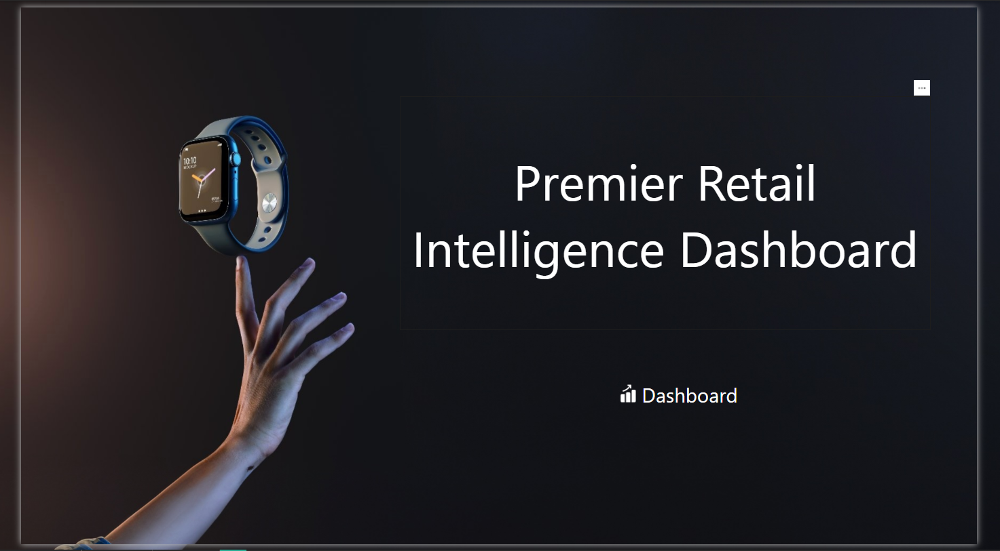
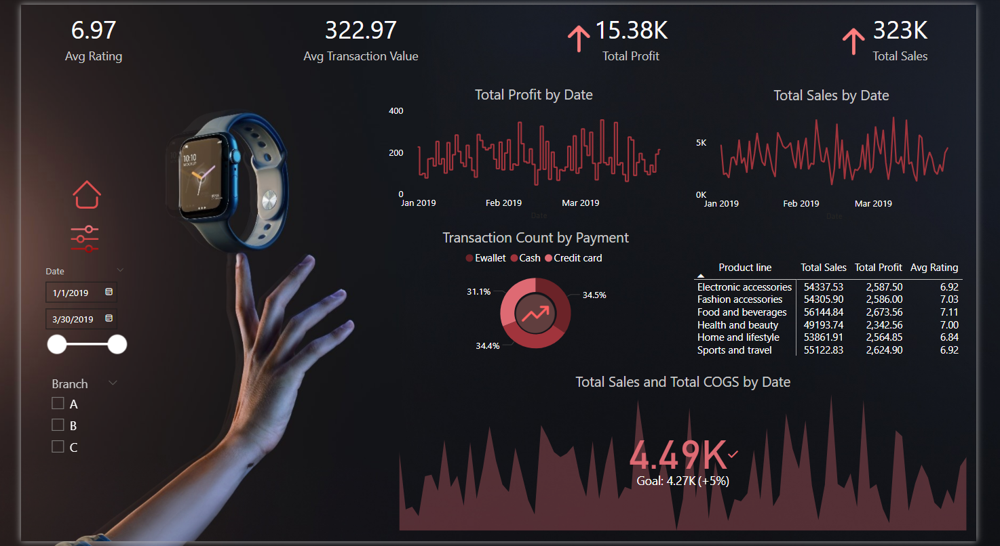

# 🛍️ Premier Retail Intelligence Dashboard

An interactive dashboard built with **Power BI** to analyze sales performance, customer ratings, and payment behavior in the retail domain.

---

## 📊 Features

- **Total Sales & Total Profit** over time
- **Average Transaction Value** & **Customer Rating**
- Product-wise performance breakdown
- Transaction count by **Payment Method**
- Dynamic filtering by **Date range** and **Branch**

---

## 🛠 Tools & Technologies

- Power BI
- DAX
- Excel (for initial data preprocessing)

---

## 🖼️ Dashboard Preview

  

---

## 🎯 Purpose

Designed to support decision makers in the retail sector with powerful visual storytelling and data-driven insights.

---

## 📂 Included Files

- `sales project.pbix` – Power BI dashboard file
- Screenshots for quick preview

---

Feel free to explore, and I’d love to hear your feedback or suggestions!
